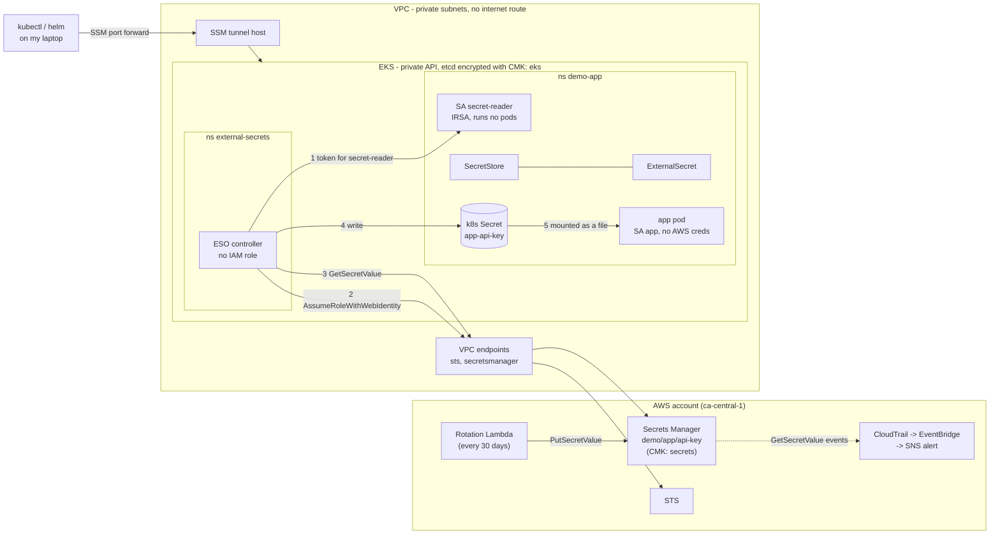

# EKS secrets with External Secrets Operator and AWS Secrets Manager

A proof of concept for getting secrets from AWS Secrets Manager into pods on a
private EKS cluster, using External Secrets Operator (ESO), and hardening every
piece along the way.

The threat model is in [THREAT_MODEL.md](THREAT_MODEL.md), the control mapping
in [CONTROLS.md](CONTROLS.md), residual risks and runbooks in
[SECURITY.md](SECURITY.md), and the deployment steps in [DEPLOY.md](DEPLOY.md).
Design decisions are in [docs/adr](docs/adr).

## The problem

Apps on Kubernetes need secrets. Putting them in Git, in Helm values or in
hand-made Kubernetes Secrets means copies everywhere, no rotation and no audit
trail. Secrets Manager fixes that on the AWS side, but the pod still needs the
value somehow.

ESO syncs a Secrets Manager secret into a native Kubernetes Secret, and the pod
mounts it. The catch is that **a Kubernetes Secret still exists in the
cluster**, base64-encoded, readable by anyone with the right RBAC. So this POC
treats three things as the attack surface:

1. the Kubernetes Secret - who can read it, who can create pods that mount it,
   how it's stored and how it's consumed
2. the ESO controller - it can read and write secrets and mint service account
   tokens, which makes it a high-value target
3. the AWS side - IAM, KMS, the secret's resource policy, network path and
   rotation

## Architecture



How a secret gets to the pod:

1. The ExternalSecret points at a namespaced SecretStore. The store says: use
   AWS Secrets Manager, and authenticate as the `secret-reader` service account.
2. The ESO controller asks the API server for a short-lived token for
   `secret-reader` (it's only allowed to mint tokens for that one SA).
3. It exchanges the token with STS for the app's IAM role. The role's trust
   policy only accepts tokens for exactly `demo-app:secret-reader`.
4. It calls `GetSecretValue` through the VPC endpoint. The secret's resource
   policy denies reads that don't come through that endpoint.
5. It writes the value to the `app-api-key` Kubernetes Secret, which EKS
   encrypts in etcd with a customer managed key.
6. The kubelet mounts the Secret into the pod as a read-only file. The app
   re-reads the file each time, so rotated values show up without a restart.

The ESO controller itself has no AWS permissions at all. AWS access always
belongs to the namespace's own service account, so a store in one namespace
can't reach another namespace's secrets.

## Layers

| Layer | What's in place |
|-------|-----------------|
| Network | Private subnets only, no NAT or internet gateway, VPC endpoints with account-scoped policies, flow logs. Default-deny NetworkPolicies; the app namespace has no network access at all, ESO can only reach DNS, the API server and the STS/Secrets Manager endpoints. |
| Cluster access | Private API endpoint only, reached through SSM port forwarding. Access entries (no aws-auth ConfigMap) for break-glass, operator and developer roles. Creator doesn't get silent cluster-admin. |
| Nodes | IMDSv2 required with hop limit 1 so pods can't get node credentials, encrypted EBS, minimal node role. |
| Kubernetes RBAC | No wildcards. Nobody except break-glass can read Secrets, exec or attach. Developers can't create pods. Operators manage ESO resources but can't read Secrets. |
| Pod security | PSA `restricted` on every namespace we own. Non-root, read-only root filesystem, no capabilities, seccomp, resource limits, images pinned by digest. |
| Admission (Gatekeeper) | Fails closed. Blocks cluster-wide and push ESO kinds and generators, static AWS keys, cross-namespace service account refs, non-AWS providers, hand-made Secrets in the app namespace, secrets in env vars, subPath secret mounts, pods running as `secret-reader`, images not from our ECR or not pinned. |
| ESO | Scoped to one namespace, no ClusterRole over secrets, token minting limited to one SA, cluster/push CRDs not installed, no IAM role, its own NetworkPolicy. |
| AWS identity | One IRSA role bound to exactly one namespace/SA, able to read exactly one secret, with KMS decrypt limited to that secret through Secrets Manager. |
| AWS data | Separate CMKs for EKS, EBS, Secrets Manager and logs, rotation on, admins can't decrypt. Secret resource policy: known readers only, VPC endpoint only, only the admin can change the policy. Terraform never holds the value. |
| Rotation | Lambda rotates every 30 days and creates the first value. ESO refreshes hourly; the pod file follows within a couple of minutes of the Kubernetes Secret changing. |
| Detection | CloudTrail trail, EventBridge alert to an encrypted SNS topic whenever anyone other than the app role or the rotation Lambda calls `GetSecretValue` on the demo secret (denied attempts included). EKS control plane logs, including audit. |

## What ESO solves, and what it doesn't

It solves:

- **One source of truth.** The value lives in Secrets Manager; the cluster
  gets a synced copy.
- **Rotation.** Secrets Manager rotates, ESO picks up the new version, the
  kubelet updates the mounted file.
- **Audit.** Every read from Secrets Manager is in CloudTrail, with the role
  that did it.
- **Nothing in Git.** Manifests only reference the secret by name.

It does not solve:

- **A Kubernetes Secret still exists.** Anyone who can `get` Secrets in the
  namespace, create a pod there, or exec into the app pod can read it. Envelope
  encryption with a CMK protects etcd storage and backups; it does nothing
  against someone who is allowed to read Secrets through the API. RBAC,
  Gatekeeper and PSA are what protect that path.
- **The ESO controller is powerful.** In its namespace it can read and write
  every Secret and mint a token for `secret-reader`. That can be narrowed, not
  removed.
- If no Kubernetes Secret may exist at all, the Secrets Store CSI Driver is the
  better fit - see [ADR 0002](docs/adr/0002-eso-vs-secrets-store-csi-driver.md).

## Failure modes

| What breaks | Running pods | New or restarted pods |
|-------------|--------------|-----------------------|
| ESO controller down | Keep working; the Kubernetes Secret and mounted file stay as they are | Start fine, they mount the existing Secret |
| Secrets Manager or STS unavailable (or the endpoint) | Keep working | Start fine. ESO marks the ExternalSecret as failing and retries; `deletionPolicy: Retain` keeps the last good value |
| Rotation happens while ESO is down | Keep the old value until ESO is back and syncs | Get the old value too |
| Gatekeeper down | Unaffected | Can't be created in non-exempt namespaces - the webhook fails closed. `kube-system` and `gatekeeper-system` are exempt so the cluster can recover |
| EKS secrets CMK disabled | Keep running until the API server restarts | Once the API server loses its cached key, the cluster can't read or write any object. Deleting the key is unrecoverable |
| Secrets Manager CMK disabled | Keep the last synced value | Same; new syncs and rotation fail |

The pods never talk to AWS, so a Secrets Manager outage doesn't take the app
down. The trade-off is that a revoked secret stays in the cluster until ESO can
sync again - revoke by rotating, and see the runbooks in SECURITY.md.

## Repository layout

```
terraform/        VPC, endpoints, KMS, EKS, nodes, tunnel host, ECR, secret,
                  rotation lambda, IRSA role, CloudTrail, alert
kubernetes/
  namespaces.yaml, rbac.yaml
  eso/            helm values, extra RBAC, network policy
  app/            service accounts, SecretStore, ExternalSecret, deployment, network policy
  gatekeeper/     helm values, namespace, library + custom templates, constraints
docs/adr/         design decisions
```

## Setup overview

Everything is deployed by hand following [DEPLOY.md](DEPLOY.md). Roughly:

1. `terraform apply` from my laptop - AWS resources only.
2. Copy the ESO, Gatekeeper and busybox images into the private ECR repos by
   digest (the cluster has no internet).
3. Open an SSM port forward to the private API and point kubectl at it using
   the break-glass role.
4. Install namespaces, Gatekeeper, ESO, RBAC and the app.
5. Check the Gatekeeper audit, then switch constraints from dryrun to deny.
6. Run the verification steps.

Local tools: Terraform >= 1.11, AWS CLI v2, kubectl, Helm 3, the Session
Manager plugin, and something that copies images by digest (`crane` or
`skopeo`).

## Cost

Rough list prices for ca-central-1 with the defaults, as of September 2026.
Check the AWS pricing pages before deploying.

| Item | Approx. per month | Per day |
|------|-------------------|---------|
| EKS control plane | 73 USD | 2.40 |
| 2 x t3.large nodes (on-demand) | 135 USD | 4.45 |
| 11 interface endpoints, 1 AZ | 88 USD | 2.90 |
| t3.micro tunnel host | 9 USD | 0.30 |
| 4 KMS keys, 1 secret | 5 USD | 0.15 |
| CloudWatch logs (EKS audit is the big one), flow logs, trail storage | 5-20 USD | 0.15-0.65 |
| **Total** | **~315-330 USD** | **~10-11 USD** |

Optional: `enable_nat = true` adds about 35 USD/month plus data processing.
Spot nodes (`node_capacity_type = "SPOT"`) cut the node cost by roughly 60-70%.
If the account already has a CloudTrail trail, this trail is a second copy of
management events and is charged per event.

Deploy, test, and tear down the same day to keep it to around 10-15 USD.

## Teardown

See the teardown section in [DEPLOY.md](DEPLOY.md). In short: delete the
in-cluster resources, `terraform destroy`, force-delete the secret if you want
to reuse the name, then check for anything left behind with the
`Project=eks-secrets-demo` tag and look at billing the next day.

## Scope

This is a single-account, single-AZ POC. Things a production setup would add
are listed at the end of [SECURITY.md](SECURITY.md).
