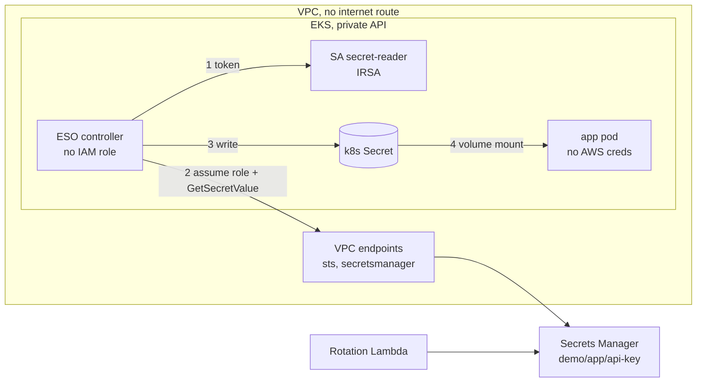

# EKS secrets with External Secrets Operator

POC: deliver AWS Secrets Manager secrets to pods on a private EKS cluster with
External Secrets Operator (ESO), and harden each piece.

Docs: [THREAT_MODEL](THREAT_MODEL.md) · [CONTROLS](CONTROLS.md) ·
[SECURITY](SECURITY.md) · [DEPLOY](DEPLOY.md) · [ADRs](docs/adr)

## Why

Secrets Manager is the source of truth, rotates and is audited. ESO syncs the
value into a Kubernetes Secret that the pod mounts. That Secret still exists in
the cluster, so the design hardens three things: who can get at the Kubernetes
Secret, the ESO controller itself, and the AWS side (IAM, KMS, network,
rotation).

## Architecture

1. ESO mints a token for the namespace's `secret-reader` service account (the
   only SA it's allowed to).
2. It swaps that for the app's IAM role and reads the secret through the VPC
   endpoint. The role only trusts `demo-app:secret-reader` and can only read
   this one secret; the secret only accepts reads through the endpoint.
3. It writes a Kubernetes Secret (etcd encrypted with a CMK).
4. The pod mounts it as a read-only file and re-reads it, so rotation lands
   without a restart. The pod itself has no AWS access and no network.

## What's hardened

- **Network**: private subnets, no NAT, VPC endpoints, default-deny
  NetworkPolicies.
- **Access**: private API through an SSM tunnel, access entries for
  break-glass / operator / developer, nobody but break-glass reads Secrets or
  execs into pods.
- **Pods**: PSA restricted, non-root, read-only fs, images by digest from our
  ECR, IMDS blocked by hop limit 1.
- **ESO**: one namespace only, no IAM role, token minting for one SA,
  cluster-wide and push CRDs not installed.
- **Gatekeeper** (fails closed): blocks ClusterSecretStore/PushSecret/generators,
  static AWS keys, cross-namespace SA refs, non-AWS providers, hand-made Secrets,
  secrets in env vars, subPath mounts.
- **AWS**: one role per namespace, one CMK per purpose, secret resource policy,
  30-day rotation, CloudTrail alert on unexpected GetSecretValue.

## What ESO doesn't solve

A Kubernetes Secret exists, so anyone who can read Secrets, create pods or exec
in the namespace can get the value. KMS encryption protects etcd, not the API.
If no Secret may exist at all, use the Secrets Store CSI Driver
([ADR 0002](docs/adr/0002-eso-vs-csi-driver.md)).

## If something is down

| Down | Running pods | New pods |
|------|--------------|----------|
| ESO, Secrets Manager or STS | fine, keep last value | fine, mount the existing Secret |
| Gatekeeper | fine | blocked (fails closed), system namespaces exempt |
| EKS CMK disabled | fine until API server restarts | cluster can't read objects |

## Cost

Roughly **10-11 USD/day** in ca-central-1 with defaults (EKS 2.40, 2 x t3.large
4.45, 11 endpoints 2.90, rest ~0.50). NAT adds ~1.20/day if enabled. Tear down
the same day - see [DEPLOY.md](DEPLOY.md).
